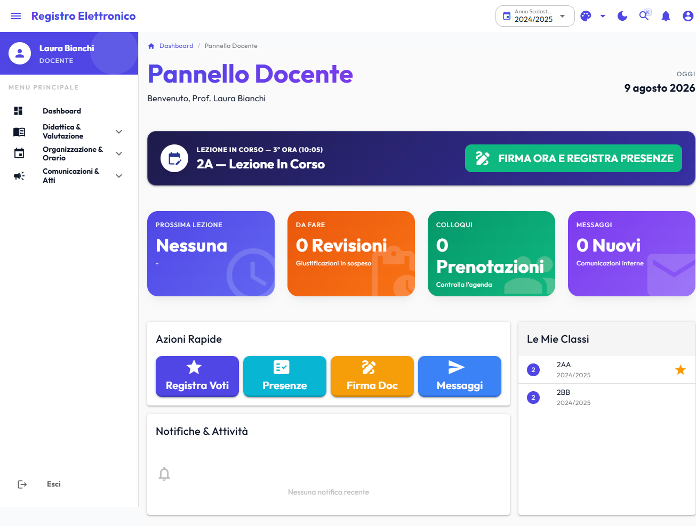
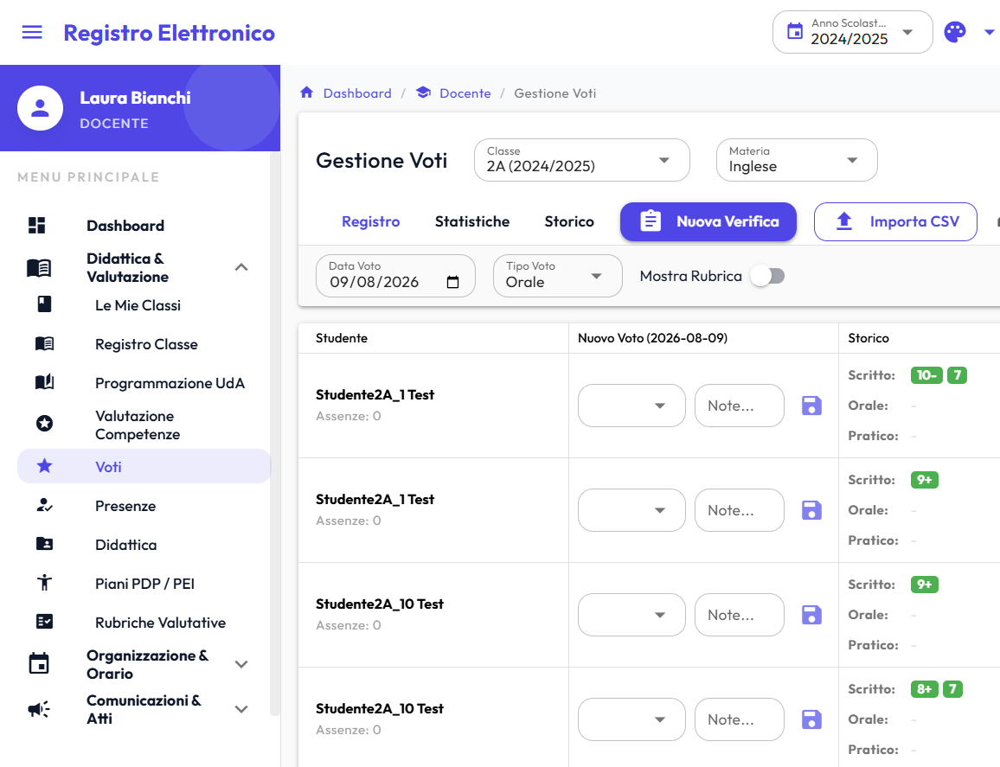
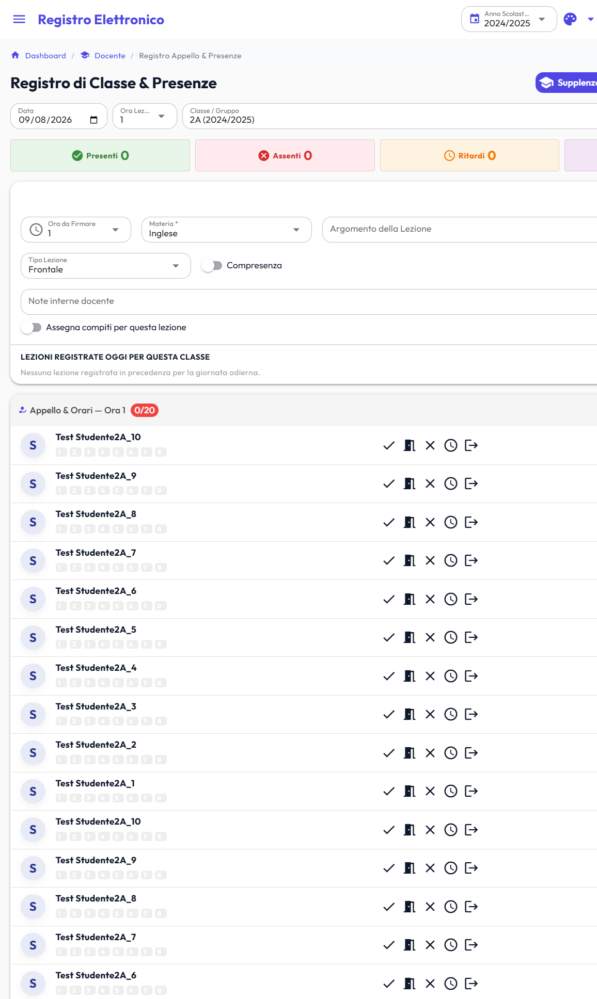
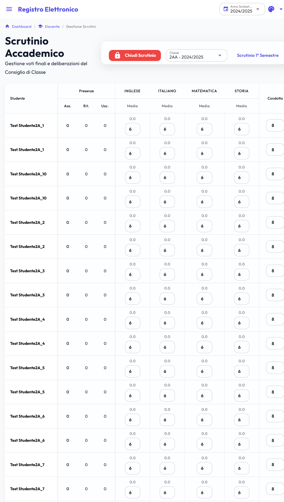
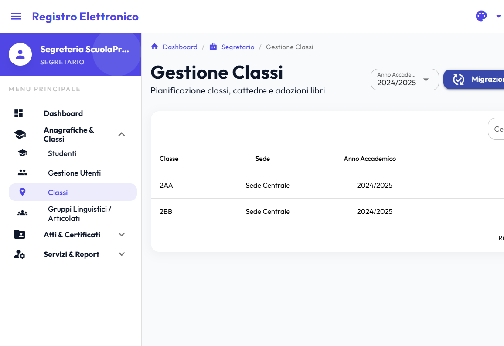
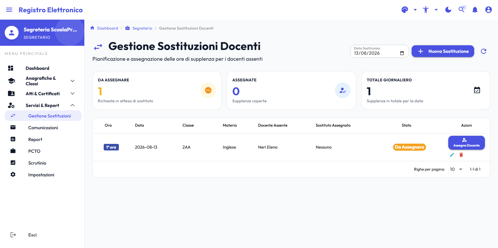
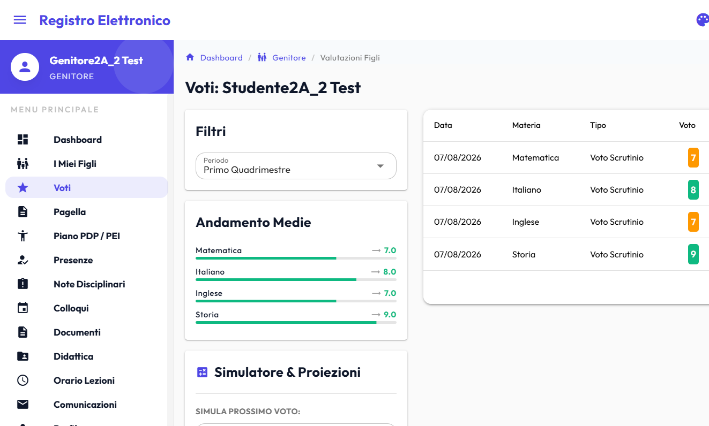

# il_registro — About & Project Overview

> **il_registro** è un sistema web full-stack per la gestione del Registro Elettronico Scolastico nelle scuole primarie e secondarie italiane.

---

## 📌 GitHub Metadata / About Info

- **Tagline**: Sistema di Registro Elettronico Scolastico moderno e completo per le scuole italiane (Go 1.27, Vue 3, Quasar, PostgreSQL 16+, App Native Android & iOS, PWA, i18n, WAI-ARIA).
- **Licenza**: [PolyForm Noncommercial 1.0.0](../LICENSE) — Gratuita e libera per scuole pubbliche, università, enti ed istituzioni pubbliche (valida per Backend, Frontend Web e App Mobile Native Android & iOS).
- **Topics / Tags**:
  `registro-elettronico` `scuola-italiana` `go` `golang` `vue3` `quasar-framework` `pinia` `postgresql` `spid` `cie` `pwa` `android` `jetpack-compose` `ios` `swiftui` `education` `school-management` `rest-api` `i18n` `accessibility`

---

## 🛠️ Architettura e Logica delle Librerie Esterne

il_registro è strutturato come **monorepo decoupled**:

```
il_registro/
├── registro-backend/   # Service Layer REST API in Go
├── registro-frontend/  # Web Application SPA/PWA in Vue 3 + Quasar
├── android/            # Progetto Multi-Modulo Android (Kotlin Compose: :student, :parent, :teacher, :secretary) [Alpha]
├── ios/                # Progetto iOS (SwiftUI, Xcode + SPM: Studente, Docente, Genitore, Segreteria) [Alpha]
└── docs/               # Documentazione tecnica e guide per sviluppatori
```

### Backend (Go 1.27+)

- **[Gin Gonic](https://github.com/gin-gonic/gin)** (`github.com/gin-gonic/gin`): Framework HTTP ad alte prestazioni per il routing REST, middleware di sicurezza e gestione delle richieste JSON.
- **[lib/pq](https://github.com/lib/pq)** (`github.com/lib/pq`): Driver nativo PostgreSQL con supporto ad indici parziali `WHERE deleted_at IS NULL` per velocizzare il soft delete.
- **[golang-jwt](https://github.com/golang-jwt/jwt)** (`github.com/golang-jwt/jwt/v5`): Gestione sicura di JWT Access Tokens (15 min) e Refresh Tokens con rotazione automatica.
- **[Gorilla WebSocket](https://github.com/gorilla/websocket)** (`github.com/gorilla/websocket`): Server WebSocket per il push delle notifiche in tempo reale (presenze, comunicazioni, sostituzioni).
- **[Viper](https://github.com/spf13/viper)** (`github.com/spf13/viper`): Configurazione gerarchica multi-ambiente via `.env`, variabili di sistema e file YAML.
- **[Bcrypt](https://golang.org/x/crypto/bcrypt)** (`golang.org/x/crypto/bcrypt`): Hashing sicuro delle password con algoritmo bcrypt e salatura personalizzata.
- **[Testify](https://github.com/stretchr/testify)** (`github.com/stretchr/testify`): Testing framework per asserzioni, suite e mock nelle unit/integration test.

### Frontend (Vue 3 + Quasar)

- **[Vue 3](https://vuejs.org/)**: Framework UI reattivo con Composition API e sintassi `<script setup>`.
- **[Quasar Framework v2](https://quasar.dev/)**: Design system completo per interfacce responsive, supporto PWA, dialoghi e tabelle ad alte prestazioni con piena accessibilità WAI-ARIA.
- **[Pinia](https://pinia.vuejs.org/)**: Store di stato centralizzato modulare (`auth`, `classes`, `attendance`, `grades`, `schoolYear`, `theme`, `websocket`, `error`).
- **[Vue Router](https://router.vuejs.org/)**: SPA Routing con Navigation Guards per il controllo degli accessi basato sui ruoli (`superadmin`, `admin`, `secretary`, `teacher`, `student`, `parent`).
- **[Axios](https://axios-http.com/)**: Client HTTP con interceptor per l'iniezione automatica dell'header `Authorization: Bearer <token>`, refresh trasparente in caso di 401 e reindirizzamento SPA senza ricaricamento pagina via Vue Router.
- **[Vue I18n](https://vue-i18n.intlify.dev/)**: Internazionalizzazione completa con dizionari `it-IT`, `en-US`, `de-DE` per menu, notifiche, form e errori.

### Mobile Native — Android & iOS (Fase Alpha — Non stabile e incompleta)

> ⚠️ **Nota sullo sviluppo Mobile**: I sorgenti delle applicazioni native in `android/` e `ios/` sono in fase **Alpha sperimentale**, attivamente sviluppate ma non stabili né complete. Condividono la licenza [PolyForm Noncommercial 1.0.0](../LICENSE).

- **[Kotlin & Jetpack Compose](https://developer.android.com/jetpack/compose)** (`android/`): 4 moduli nativi (`:student`, `:parent`, `:teacher`, `:secretary`), Material 3 UI, Biometria, Offline Cache, 11 lingue.
- **[Swift & SwiftUI](https://developer.apple.com/swift/)** (`ios/`): Progetto Xcode (`RegistroStudente.xcodeproj`) e Swift Package Manager con 4 schemi/target (`RegistroStudente`, `RegistroDocente`, `RegistroGenitore`, `RegistroSegreteria`), LocalAuthentication, 11 lingue.

---

## ⚡ Caratteristiche Tecniche e Ottimizzazioni Recenti

1. **Gestione Multi-Sede delle Classi:** Supporto completo per l'organizzazione delle classi su differenti plessi/sedi (es. Sede Centrale, Succursale).
2. **Sincronizzazione Bidirezionale Orario Scolastico:** Single source of truth su `class_schedules` per la gestione dell'orario di classe e docente con aggiornamento atomico bidirezionale in tempo reale.
3. **Sicurezza Password Self-Service & Role-Bounded Reset:** Cambio password personalizzato per Admin/SuperAdmin nelle Impostazioni e restrizione del reset password della Segreteria ai soli ruoli docenti, studenti e genitori.
4. **Algoritmo di Raccomandazione Supplenze:** Calcolo automatico dello score di idoneità (0-95) dei supplenti basato su assegnazione classe, materia e carico settimanale.
5. **Controllo Concorrenza Prenotazioni (Race Condition Zero):** Blocco atomico in DB via `SELECT ... FOR UPDATE` per le prenotazioni dei colloqui e modifiche agli slot.
6. **Scrutini Ottimizzati in Batch:** Caricamento aggregato delle statistiche di presenza tramite `GetStatsBatch` per eliminare le query N+1 nella matrice di scrutinio.
7. **Indici Parziali PostgreSQL (Soft Delete):** Indici B-tree parziali `WHERE deleted_at IS NULL` per tabelle `grades`, `attendance`, `users`, `classes`, `documents` e `communications`.
8. **Rate Limiter con Client IP Resolution:** Validazione stringente IP con `resolveClientIP` e blocco degli IP spoofing tramite `X-Forwarded-For`.
9. **Reattività WebSockets & Stores Pinia:** Sincronizzazione automatica ed immediata dello stato locale (`grades`, `attendance`, `scrutiny`, `communications`) alla ricezione di messaggi real-time.
10. **Accessibilità & Font DSA OpenDyslexic:** Toggle rapido del font ad alta leggibilità per studenti con dislessia e DSA.

---

## 📸 Galleria Screenshot

<a href="./images/01_dashboard_teacher.png"></a>

1. **`01_dashboard_teacher.png` — Dashboard Docente & Timeline**
   - _Descrizione_: Vista principale del docente con lezioni del giorno, accessi rapidi ai registri di classe, circolari e notifiche in tempo reale.

<a href="./images/02_grade_matrix_input.png"></a>

2. **`02_grade_matrix_input.png` — Registro Voti & Tastiera Rapida**
   - _Descrizione_: Tabella dei voti con navigazione da tastiera, simulatore voto target e visualizzazione delle misure compensative BES/DSA.

<a href="./images/03_attendance_1click.png"></a>

3. **`03_attendance_1click.png` — Registro Presenze & Firma Ora 1-Click**
   - _Descrizione_: Interfaccia di rilevamento presenze/assenze/ritardi con pulsante di firma rapida della lezione.

<a href="./images/04_scrutiny_matrix.png"></a>

4. **`04_scrutiny_matrix.png` — Matrice di Scrutinio & Pagelle**
   - _Descrizione_: Tabella riepilogativa dello scrutinio di classe con medie per materia, proposte voto e statistiche assenze aggregate.

<a href="./images/05_classes_multisite.png"></a>

5. **`05_classes_multisite.png` — Gestione Classi Multi-Sede**
   - _Descrizione_: Pagina di gestione segreteria con la visualizzazione della Sede scolastica (es. Sede Centrale, Succursale) per ciascuna classe.

<a href="./images/06_substitutions_recommendation.png"></a>

6. **`06_substitutions_recommendation.png` — Suggerimento Automatico Supplenze**
   - _Descrizione_: Algoritmo di calcolo dello score supplenti con i dettagli di materia, classe e carico orario settimanale.

<a href="./images/07_parent_portal_mobile.png"></a>

7. **`07_parent_portal_mobile.png` — Portale Genitori & PWA Mobile**
   - _Descrizione_: Vista responsive mobile del portale genitori con presa visione circolari, giustifica assenze e libretto voti.

<a href="./images/08_accessibility_opendyslexic.png"></a>

8. **`08_accessibility_opendyslexic.png` — Accessibilità & Font DSA**

- _Descrizione_: Dettaglio dell'interfaccia con font OpenDyslexic attivo e modalità ad alto contrasto.

---

## 🧪 Architettura dei Test

### Backend Testing (Go)

1. **Unit Tests**:
   - `internal/auth/handler_test.go`, `internal/classes/service_test.go`, `internal/grades/handler_test.go`, `internal/attendance/service_test.go`, `internal/substitutions/service_test.go`
   - Test dei singoli moduli isolati mediante mock repository (pacchetto `tests/testhelpers`).
2. **Integration Tests**:
   - `tests/integration/scuola_prova_workflow_test.go`
   - `tests/integration/full_school_workflow_integration_test.go`
   - Test di integrazione del database e dei workflow completi multi-ruolo (Scuola di Prova, coordinamento docenti, RLS).

Esecuzione dei test backend:

```bash
cd registro-backend
go test ./... -v
```

### Frontend Testing (Vue 3 / JavaScript)

1. **Unit & Component Testing (Vitest)**:
   - `tests/unit/pages/Teacher/Attendance.spec.js`
   - `tests/unit/pages/Admin/Analytics.spec.js`
   - `tests/unit/stores/attendance.spec.js`
2. **End-to-End Testing (Playwright)**:
   - `tests/e2e/teacher-workflow.spec.js`
   - `tests/e2e/parent-workflow.spec.js`

Esecuzione dei test frontend:

```bash
cd registro-frontend
npm run test:unit
```
