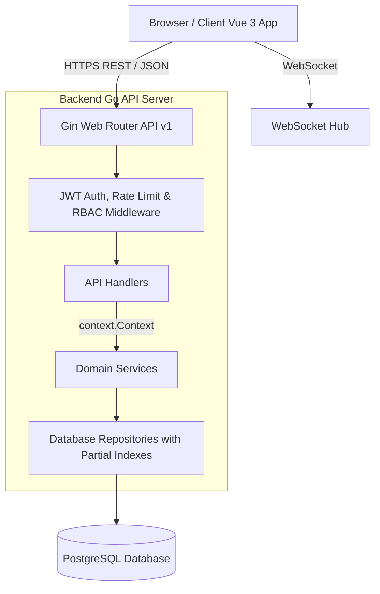

# 📚 WIKI — RegistroV2 Developer & Architecture Guide

Benvenuto nel Wiki di **RegistroV2**. Questa guida completa è pensata per sviluppatori, architetti e maintainer del progetto. Fornisce una visione approfondita dell'architettura del sistema, dei modelli dati, delle regole di sicurezza RBAC, dei flussi applicativi e delle linee guida per l'estensione del codice.

---

## 📑 Indice

1. [Visione Generale e Stack Tecnologico](#1-visione-generale-e-stack-tecnologico)
2. [Architettura del Sistema](#2-architettura-del-sistema)
3. [Modelli Dati e Relazioni (ER)](#3-modelli-dati-e-relazioni-er)
4. [Matrice di Sicurezza e Permessi (RBAC)](#4-matrice-di-sicurezza-e-permessi-rbac)
5. [Flussi di Lavoro Principali](#5-flussi-di-lavoro-principali)
6. [Guida allo Sviluppo Locale e Test](#6-guida-allo-sviluppo-locale-e-test)
7. [Struttura del Codebase](#7-struttura-del-codebase)
8. [Guida all'Estensione del Codice](#8-guida-allestensione-del-codice)
9. [Infrastruttura di Monitoring & System Metrics](#9-infrastruttura-di-monitoring--system-metrics)
10. [Best Practices & Troubleshooting](#10-best-practices--troubleshooting)

---

## 1. Visione Generale e Stack Tecnologico

**RegistroV2** è un registro elettronico scolastico di nuova generazione, multi-tenant e multi-ruolo, progettato per garantire elevate prestazioni, sicurezza ed un'esperienza utente moderna e reattiva.

### Backend 🐹

- **Linguaggio**: Go (v1.25+)
- **Framework Web**: [Gin Gonic](https://github.com/gin-gonic/gin)
- **Database**: PostgreSQL (v16+) con indici parziali B-tree (`WHERE deleted_at IS NULL`) per tabelle ad alto volume.
- **Autenticazione**: JWT (RSA SHA256 / HMAC) con Refresh Token, MFA (TOTP) e Rate Limiting dedicato (5 req/min) per endpoint di auth.
- **Context Propagation**: Firme dei Service uniformate con `ctx context.Context` per distributed tracing e cancellazione query.
- **Error Codes Strutturati**: Risposte di errore JSON uniformi con attributo `code`.

### Frontend ⚡

- **Framework**: Vue 3 (Composition API `<script setup>`)
- **UI Framework**: [Quasar Framework](https://quasar.dev) con accessibilità WAI-ARIA (Skip Links, landmark semantici, ruoli aria)
- **State Management**: [Pinia](https://pinia.vuejs.org) con caching in-memory dei voti (`useGradesStore`) e Bus errori globale (`useErrorStore`)
- **Routing & Interceptor**: Vue Router integrato con Axios (`setApiRouter`) per reindirizzamento SPA senza full page reloads.
- **Real-time Notifications**: Store WebSocket con monitoraggio attivo dei riconnessioni e stato errori (`reconnectAttempts`, `hasFailedPermanently`).

---

## 2. Architettura del Sistema



---

## 8. Guida all'Estensione del Codice

### Come Aggiungere un Nuovo Endpoint / Modulo Backend

1. **Definisci i Modelli**: Crea un file `model.go` ed i DTO in `dto.go` all'interno di `internal/<modulo>`.
2. **Definisci il Repository**: Crea `repository.go` con le query SQL parametrizzate ed eventuali indici parziali se la tabella supporta soft-delete.
3. **Implementa il Service con Context**: Crea `service.go` accettando `ctx context.Context` come primo parametro in ogni metodo pubblico.
4. **Implementa l'Handler HTTP con Structured Errors**: Crea `handler.go` restituendo risposte di errore trasmettendo sia il campo `code` sia `error`.
5. **Registra le Rotte**: In `cmd/api-server/main.go`, istanzia repository, service ed handler e registra le rotte.

### Come Aggiungere una Nuova Pagina / Store Frontend

1. **Crea il Service API**: Aggiungi il metodo di chiamata HTTP in `src/services/<modulo>Service.js`.
2. **Crea il Pinia Store con Caching**: Definisci lo stato, la mappa di cache e le action async in `src/stores/<modulo>.js`.
3. **Usa `useErrorHandler`**: Utilizza il composable `useErrorHandler` nei componenti per intercettare ed avvisare l'utente.
4. **Registra la Rotta**: Aggiungi la rotta in `src/router/routes.js` associando i meta di ruolo corretti.

---

## 10. Best Practices & Troubleshooting 🛠️

### A. Backend (Go / Gin)

- **Propagazione del Context**: Passa sempre `c.Request.Context()` dagli handler ai metodi di service per consentire a PostgreSQL di interrompere query lunghe se l'utente annulla la richiesta.
- **Indici PostgreSQL per Soft Delete**: Su ogni nuova tabella che include la colonna `deleted_at`, crea un indice parziale:
  ```sql
  CREATE INDEX IF NOT EXISTS idx_nometabella_deleted_at_null ON nometabella (school_id, ...) WHERE deleted_at IS NULL;
  ```

### B. Frontend (Vue 3 / Vitest)

- **Gestione Router negli Interceptor**: Usa `setApiRouter(router)` in `src/router/index.js` anziché `window.location.href` per mantenere la navigazione SPA fluida ed evitare perdite di stato client su sessione scaduta.
