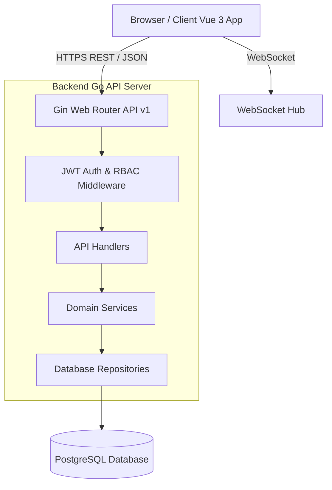

# 📚 WIKI — RegistroV2 Developer & Architecture Guide

Benvenuto nel Wiki di **RegistroV2**. Questa guida completa è pensata per sviluppatori, architetti e maintainer del progetto. Fornisce una visione approfondita dell'architettura del sistema, dei modelli dati, delle regole di sicurezza RBAC, dei flussi applicativi e delle linee guida per l'estensione del codice.

---

## 📑 Indice

1. [Visione Generale e Stack Tecnologico](#1-visione-generale-e-stack-tecnologico)
2. [Architettura del Sistema](#2-architettura-del-sistema)
3. [Modelli Dati e Relazioni (ER)](#3-modelli-dati-e-relazioni-er)
4. [Matrice di Sicurezza e Permessi (RBAC)](#4-matrice-di-sicurezza-e-permessi-rbac)
5. [Flussi di Lavoro Principali](#5-flussi-di-lavoro-principali)
6. [Guida allo Sviluppo Locale e Test](#6-guida-allo-sviluppo-locale-e-test)
7. [Struttura del Codebase](#7-struttura-del-codebase)
8. [Guida all'Estensione del Codice (Come aggiungere una nuova feature)](#8-guida-allestensione-del-codice)

---

## 1. Visione Generale e Stack Tecnologico

**RegistroV2** è un registro elettronico scolastico di nuova generazione, multi-tenant e multi-ruolo, progettato per garantire elevate prestazioni, sicurezza ed un'esperienza utente moderna e reattiva.

### Backend 🐹
- **Linguaggio**: Go (v1.21+)
- **Framework Web**: [Gin Gonic](https://github.com/gin-gonic/gin)
- **Database**: PostgreSQL (v15+)
- **Autenticazione**: JWT (RSA SHA256 / HMAC) con Refresh Token e MFA (TOTP)
- **Logging & Monitoring**: Zap Logger, Middleware Prometheus/Metrics, Circuit Breaker
- **Test**: Standard Go `testing`, `testify/assert`, `testify/mock`

### Frontend ⚡
- **Framework**: Vue 3 (Composition API `<script setup>`)
- **UI Framework**: [Quasar Framework](https://quasar.dev)
- **State Management**: [Pinia](https://pinia.vuejs.org) (v3+)
- **Build Tool**: Vite (v5+)
- **Testing**: Vitest (v4+) & `@vue/test-utils`

---

## 2. Architettura del Sistema



---

## 3. Modelli Dati e Relazioni (ER)

### Entità Principali

```mermaid
erDiagram
    SCHOOL ||--o{ USER : contains
    SCHOOL ||--o{ CLASS : owns
    SCHOOL ||--o{ SUBJECT : offers
    CLASS ||--o{ STUDENT : contains
    USER ||--o{ GUARDIAN_LINK : "guardian of"
    STUDENT ||--o{ GUARDIAN_LINK : "child of"
    CLASS ||--o{ LESSON : has
    TEACHER ||--o{ LESSON : teaches
    TEACHER ||--o{ LESSON : "substitutes in"
    LESSON ||--o{ HOMEWORK : assigns
    STUDENT ||--o{ ATTENDANCE : has
    STUDENT ||--o{ GRADE : receives
    SUBJECT ||--o{ TEXTBOOK : adopts
```

- **School**: Rappresenta l'istituto scolastico (multi-tenancy via `school_id`).
- **User**: Utente di sistema con ruolo (`superadmin`, `admin`, `secretary`, `teacher`, `student`, `parent`).
- **Class**: Classe scolastica (es. `1A`, `5B`).
- **Subject**: Materia di insegnamento (es. `Matematica`, `Italiano`, `Storia`).
- **Lesson**: Registro delle lezioni svolte (argomento, ora, docente titolare o docente in **sostituzione**).
- **Homework**: Compito/esercizio in agenda con data di consegna e tipologia.
- **Grade**: Valutazione del docente (voto numerico, giudizio, peso, tipologia).
- **Attendance**: Registro presenze/assenze/ritardi con giustificazioni.
- **Textbook**: Libri di testo adottati associati alle materie scolastiche.

---

## 4. Matrice di Sicurezza e Permessi (RBAC)

| Risorsa / Endpoint | Superadmin | Admin (Scuola) | Segreteria | Docente | Studente | Genitore |
| :--- | :---: | :---: | :---: | :---: | :---: | :---: |
| `POST /schools` | ✅ | ✅ | ❌ | ❌ | ❌ | ❌ |
| `POST /users` | ✅ | ✅ | ✅ | ❌ | ❌ | ❌ |
| `POST /classes` | ✅ | ✅ | ✅ | ❌ | ❌ | ❌ |
| `POST /subjects` | ✅ | ✅ | ✅ | ❌ | ❌ | ❌ |
| `POST /lessons` | ✅ | ✅ | ❌ | ✅ | ❌ | ❌ |
| `POST /homeworks` | ✅ | ✅ | ❌ | ✅ | ❌ | ❌ |
| `POST /grades` | ✅ | ✅ | ❌ | ✅ | ❌ | ❌ |
| `POST /attendance/mark` | ✅ | ✅ | ❌ | ✅ | ❌ | ❌ |
| `GET /grades/my-grades` | ❌ | ❌ | ❌ | ❌ | ✅ | ❌ |
| `GET /grades/child-grades` | ❌ | ❌ | ❌ | ❌ | ❌ | ✅ (figli propri) |

---

## 5. Flussi di Lavoro Principali

### A. Onboarding Scuola e Utenti
1. Il **Superadmin** crea la scuola tramite `POST /api/v1/schools`.
2. Il Superadmin o l'**Admin** crea l'account **Segreteria** via `POST /api/v1/users`.
3. La Segreteria registra la classe (`POST /api/v1/classes`), i docenti, lo studente ed il genitore, collegando il genitore allo studente tramite `POST /api/v1/users/:id/guardians`.

### B. Gestione Lezioni, Sostituzioni ed Agenda
1. Il docente titolare o il docente in sostituzione apre la lezione tramite `POST /api/v1/lessons`.
2. Se si tratta di una **sostituzione**, vengono popolati i campi `is_substitution: true`, `substituted_teacher_id` e `substituted_teacher_name`.
3. Il docente assegna i compiti in agenda con `POST /api/v1/homeworks`.
4. Lo studente ed il genitore visualizzano immediatamente la lezione (con il badge *Sostituzione*) ed i compiti assegnati nelle rispettive dashboard ed agende.

---

## 6. Guida allo Sviluppo Locale e Test

### Requisiti
- Go v1.21+
- Node.js v18+ e npm
- PostgreSQL v15+ (opzionale se si usano i mock di integrazione)

### Comandi Backend
```bash
cd registro-backend

# Esegui il server di sviluppo
go run cmd/api-server/main.go

# Esegui tutti i test unitari e d'integrazione
go test -v ./...
```

### Comandi Frontend
```bash
cd registro-frontend

# Installa le dipendenze
npm install

# Avvia il server dev Vite (http://localhost:9000)
npm run dev

# Esegui la suite completa dei test Vitest
npm run test:unit

# Esegui la build di produzione
npm run build
```

---

## 7. Struttura del Codebase

```
Registrov2/
├── docs/                        # Documentazione di progetto e API
│   ├── API_REFERENCE.md
│   ├── ARCHITECTURE.md
│   ├── FRONTEND_GUIDE.md
│   ├── SETUP_GUIDE.md
│   └── WIKI.md                  # Questo Wiki per sviluppatori
├── registro-backend/            # Backend in Go (Clean/Layered Architecture)
│   ├── cmd/api-server/          # Entrypoint server Gin
│   ├── internal/                # Package interni di dominio
│   │   ├── auth/                # Autenticazione & JWT
│   │   ├── classes/             # Gestione classi
│   │   ├── grades/              # Voti e valutazioni
│   │   ├── attendance/          # Presenze ed assenze
│   │   ├── lessons/             # Lezioni ed agenda
│   │   ├── substitutions/       # Gestione sostituzioni docenti
│   │   ├── subjects/            # Materie scolastiche
│   │   ├── textbooks/           # Libri di testo e adozioni
│   │   └── users/               # Gestione utenti e tutori
│   └── tests/                   # Suite di test di integrazione e unitari
└── registro-frontend/           # Frontend Vue 3 + Quasar + Pinia
    ├── src/
    │   ├── composables/         # Composables riutilizzabili (useMenuItems, useAuth, etc.)
    │   ├── layouts/             # Layout di pagina (MainLayout.vue)
    │   ├── pages/               # Pagine divise per ruolo (admin, secretary, teacher, student, parent)
    │   ├── services/            # Client API HTTP Axios
    │   └── stores/              # Pinia Stores per gestione stato
    └── tests/                   # Test Vitest (unit, e2e, security, flows)
```

---

## 8. Guida all'Estensione del Codice

### Come Aggiungere un Nuovo Endpoint / Modulo Backend
1. **Definisci i Modelli**: Crea un file `model.go` ed i DTO in `dto.go` all'interno di `internal/<modulo>`.
2. **Definisci il Repository**: Crea `repository.go` con le query SQL o l'interfaccia di persistenza.
3. **Implementa il Service**: Crea `service.go` contenente la logica di business e la validazione dei ruoli.
4. **Implementa l'Handler HTTP**: Crea `handler.go` con l'estrazione del contesto Gin (`user_id`, `role`, `school_id`) e la gestione delle risposte HTTP.
5. **Registra le Rotte**: In `cmd/api-server/main.go`, istanzia repository, service ed handler e registra le rotte nel gruppo `protected`.
6. **Aggiungi i Test**: Crea i test di integrazione in `tests/integration/` per verificare sia il caso di successo che le restrizioni RBAC.

### Come Aggiungere una Nuova Pagina / Store Frontend
1. **Crea il Service API**: Aggiungi il metodo di chiamata HTTP in `src/services/<modulo>Service.js`.
2. **Crea il Pinia Store**: Definisci lo stato, i getter e le action async in `src/stores/<modulo>.js`.
3. **Crea la Vista Componente**: Crea la pagina in `src/pages/<ruolo>/<Feature>.vue` utilizzando Quasar e i token stilistici di progetto.
4. **Registra la Rotta**: Aggiungi la rotta in `src/router/routes.js` associando i meta di ruolo corretti.
5. **Aggiungi i Test**: Crea i test Vitest in `tests/unit/` per testare lo store ed i comportamenti di UI/UX.

---
*Wiki creato per supportare lo sviluppo, la manutenzione e l'onboarding di nuovi sviluppatori su RegistroV2.*
