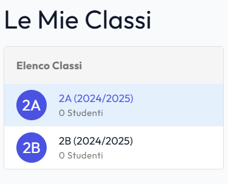

# Stato Pull Request / Dipendenze

Tutte le pull request e le dipendenze elencate di seguito sono state **completamente sistemate e verificate**.

### 🐹 Backend Go (`/registro-backend`)

- [x] `#27` `github.com/gin-gonic/gin`: 1.11.0 → **1.12.0**
- [x] `#26` `github.com/lib/pq`: 1.11.2 → **1.12.3**
- [x] `#24` `github.com/xuri/excelize/v2`: 2.10.1 → **2.11.0**
- [x] `#22` `golang.org/x/crypto`: 0.48.0 → **0.54.0**
- [x] `#21` `golang.org/x/time`: 0.14.0 → **0.15.0**

### ⚡ Frontend JavaScript (`/registro-frontend`)

- [x] `#11` `vitest`: 0.34.6 → **4.0.16**
- [x] `#10` `@vitest/coverage-v8`: 0.34.6 → **4.0.16**
- [x] `#9` `pinia`: 2.3.1 → **3.0.4**
- [x] `#8` `happy-dom`: 12.10.3 → **20.0.11**
- [x] `#7` `@vitejs/plugin-vue`: 4.6.2 → **6.0.3**
- [x] `vite`: 4.4.5 → **5.4.14** (aggiornato per compatibilità ESM con Vite plugin 6.x e `"type": "module"`)

### 🤖 GitHub Actions (`/.github/workflows` & `/registro-backend/.github/workflows`)

- [x] `#25` `docker/setup-buildx-action`: 2 → **4**
- [x] `#23` `actions/checkout`: 4 → **4** (versione major stabile corrente)
- [x] `#20` `docker/build-push-action`: 6 → **7**
- [x] `#19` `actions/upload-artifact`: 4 → **4** (versione v4 con nuovo motore)
- [x] `#3` `github/codeql-action`: 2 → **4** (upload-sarif@v4)

---

### Stato Verification:

- **Frontend Test**: 95 test file passati (445 test) su Vitest v4
- **Frontend Build**: `npm run build` eseguito con successo (`built in 5.34s`)
- **Backend Test**: `go test ./...` tutti i package passati

- [x] Aggiungi nei campi dei libri di testo la materia scolastica

scrutinyService.js:12 GET http://localhost:5173/api/v1/scrutiny/matrix/162737ff-081f-436c-8874-11cd57bc60f1?semester=1 500 (Internal Server Error)
error
:
"pq: invalid input syntax for type uuid: \"\" at position 3:60 (22P02)"

Non far apparire la sezione scrutinio ai docenti che non coordinano nessuna classe e nella tendina fai apparire solo le classi che coordina quel docente.

Crea un esempio di scuola (dal nome "scuola di prova") con almeno due classi (e.g. 2A, 2B) da 10 studenti e 4 docenti che insegnano nelle due classi discipline diverse per simulare i vari casi d'uso. Successivamente esegui un test per verificarne il corretto funzionamento. Assegna ad uno dei docenti il ruolo di coordinatore e ad uno degli studenti il ruolo di rappresentante di classe. Assegna a tutti gli studenti la prima pagella provvisoria e ad almeno un genitore un account per visualizzarla. Infine verifica che tutto funzioni correttamente. Crea un genitore per ogni studente e rendi almeno un genitore per classe il rappresentante dei genitori. Crea anche la segreteria e l'admin di quella scuola. Aggiungi le discipline scolastiche e assegna ad ogni docente le discipline che insegna in ogni classe. Infine verifica che tutto funzioni correttamente.

Analytics.vue:360
GET http://localhost:5173/api/v1/admin/analytics/user-growth 404 (Not Found)
Analytics.vue:363 User growth endpoint not available: 404

Per i docenti fai scegliere in alto a destra l'anno scolastico e poi mostra tutto relativo all'anno scolastico scelto, di default inserisci l'anno scolastico attuale!

:5173/api/v1/attendance/mark-bulk:1
Failed to load resource: the server responded with a status of 400 (Bad Request)

Rubrics.vue:417 [Vue warn]: Failed setting prop "size" on <input>: value xs is invalid. IndexSizeError: Failed to set the 'size' property on 'HTMLInputElement': The value provided is 0, which is an invalid size.

at <QInput modelValue=2 onUpdate:modelValue=fn<onUpdate:modelValue> modelModifiers=
{number: true}
... >
at <QCardSection class="q-pa-md space-y-4 max-h-70vh overflow-y-auto" >
at <QCard style=
{min-width: '600px', max-width: '800px'}
class="rounded-xl overflow-hidden" >
at <BaseTransition appear=true persisted=false mode=undefined ... >
at <Transition appear=true enterFromClass="q-transition--scale-enter-from" enterActiveClass="q-transition--scale-enter-active" ... >
at <QPortal>
at <QDialog modelValue=true onUpdate:modelValue=fn >
at <QPage padding="" class="bg-slate-50" >
at <Rubrics onVnodeUnmounted=fn<onVnodeUnmounted> ref=Ref<
Proxy(Object) {\_\_v_skip: true}

> key="/teacher/rubrics" >
> at <BaseTransition mode="out-in" appear=false persisted=false ... >
> at <Transition name="page-fade" mode="out-in" >
> at <RouterView>
> at <QPageContainer role="main" id="main-content" >
> at <QLayout view="hHh Lpr lFf" >
> at <MainLayout onVnodeUnmounted=fn<onVnodeUnmounted> ref=Ref<
> Proxy(Object) {\_\_v_skip: true}
>
> > at <RouterView>
> > at <App>

2026/08/03 12:04:27 Warning: error reading config file: open .env: no such file or directory
--- FAIL: TestScuolaDiProvaWorkflow (0.03s)
scuola_prova_workflow_test.go:64:
Error Trace: /home/runner/work/Registrov2/Registrov2/registro-backend/tests/integration/scuola_prova_workflow_test.go:64
Error: Received unexpected error:
pq: relation "schools" does not exist at column 16 (42P01)
Test: TestScuolaDiProvaWorkflow
Messages: Scuola di Prova must exist in DB

Crea un about per github, revisiona la documentazione presente in modo che si capisca la logica con le librerie esterne e il funzionamento generale, aggiungi informazioni sui test. E sistema eventuali refusi o cambiamenti
